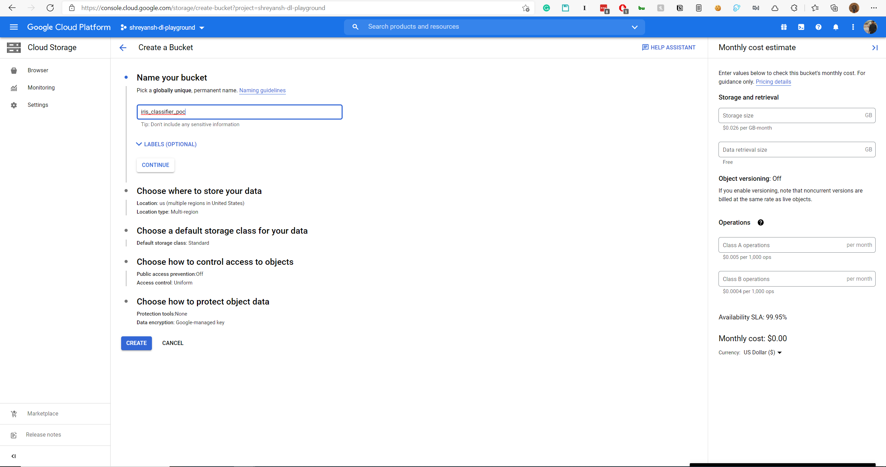
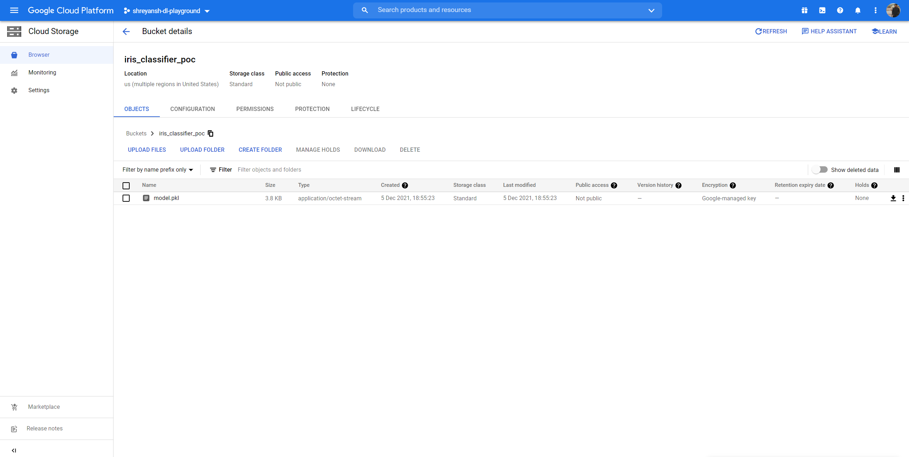
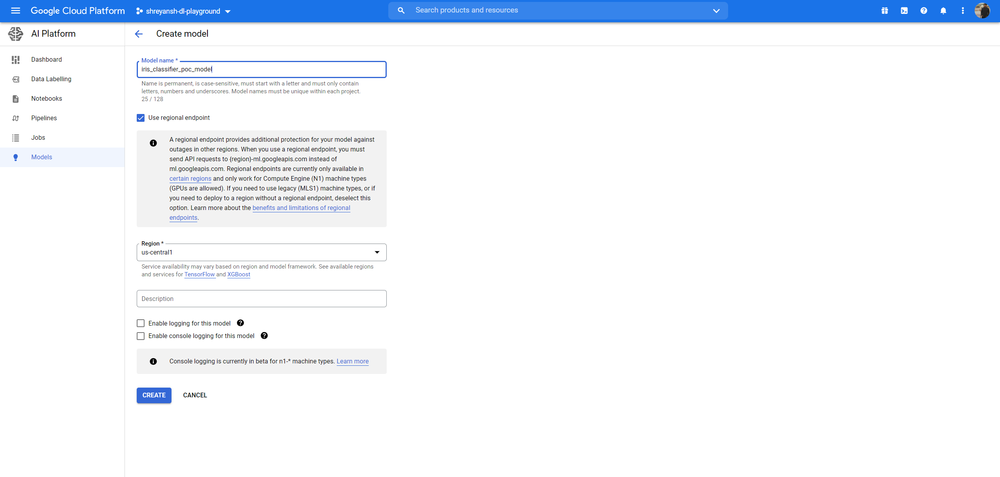
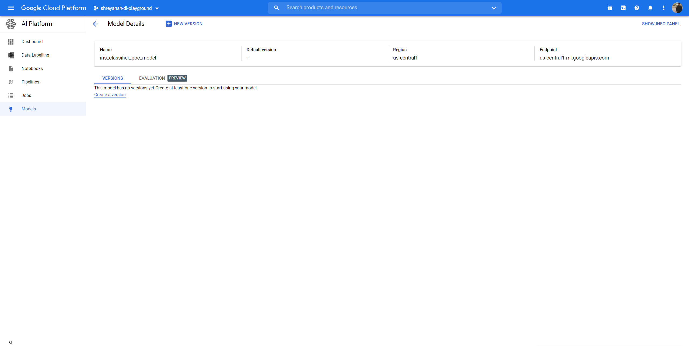
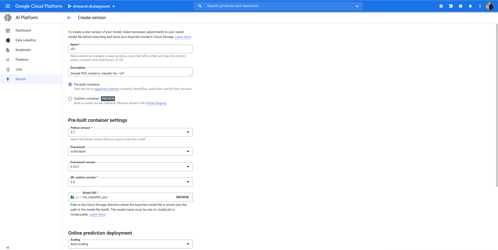
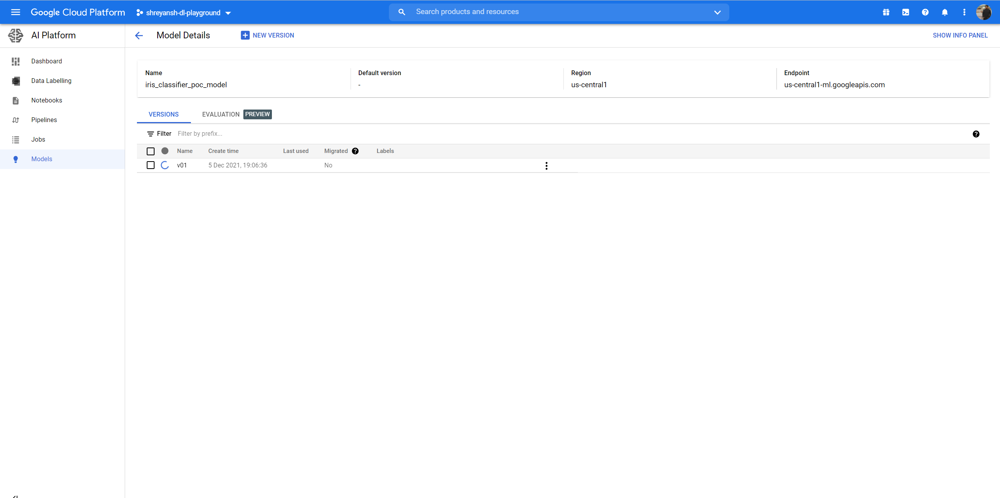
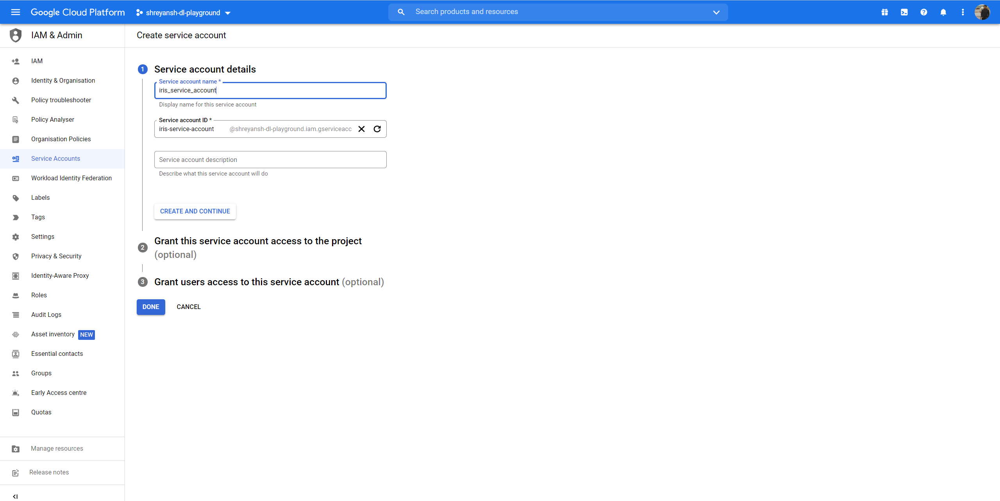
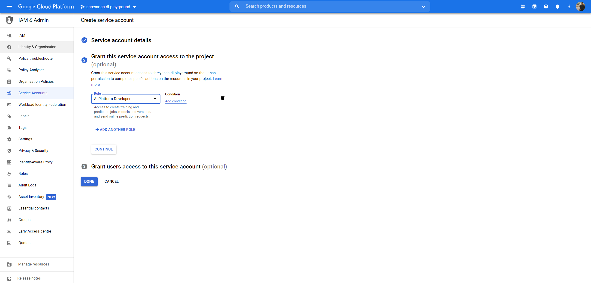
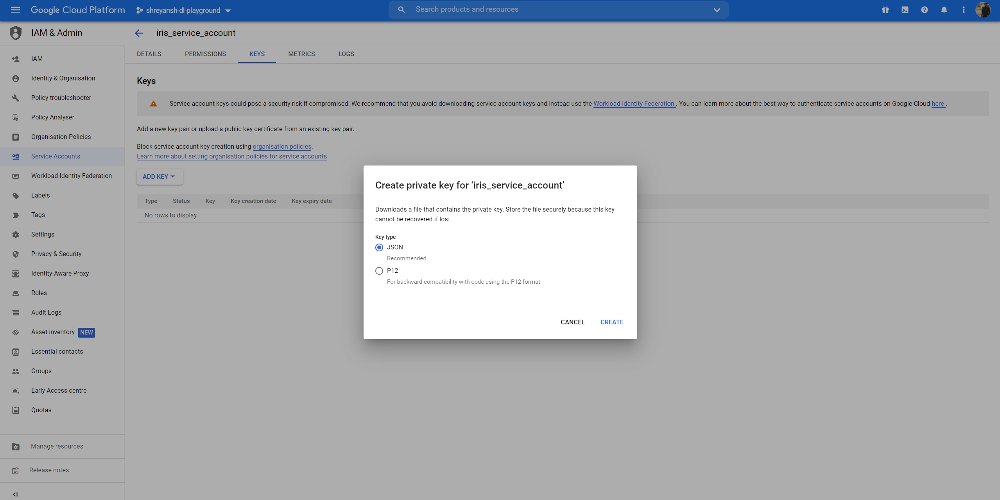
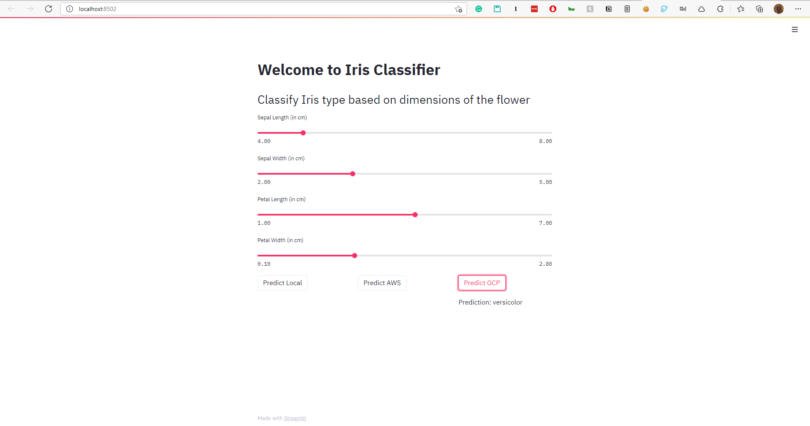

# Iris classification PoC deployed using AI Platform

## What this repo contains?

This repository has the code to train, save and test a simple ML model on the Iris Dataset. 
The Iris dataset is a small dataset which contains attributes of the flower - Sepal length, Sepal width, Petal length and Petal width.
The goal of the task is to classify based on these dimensions, the type of the Iris, which in the dataset is among three classes - Setosa, Versicolour and Virginica.

I also detail the steps required to deploy the model on the Google Cloud AI Platform.
And finally, the repository contains the code to run a Streamlit app with the model deployed on the AI Platform.

## Package Requirements
* A Google Cloud account and a Google Cloud Project (using GCP will cause money if you don't have any of the free $300 credits you get when you first sign up)
* Python 3.6+
* A simple 
`pip install -r requirements.txt` from the [iris_classification](iris_classification) directory will install the other Python packages required.


## Steps to follow
In this PoC, I will be training and deploying a simple ML model. If you follow this tutorial, deploying models should be fairly easy as well.

### 1. Training and Deploying the model locally

1. Clone this repo
```
git clone https://github.com/shreyansh26/Iris_classification-GCP-AI-Platform-PoC
```

2. Create a virtual environment - I use [Miniconda](https://docs.conda.io/en/latest/miniconda.html), but you can use any method (virtualenv, venv)
```
conda create -n iris_project python=3.8
conda activate iris_project
```

3. Install the required dependencies
```
pip install -r requirements.txt
```

4. Train the model
```
cd iris_classification/src
python train.py
```

3. Verify the model trained correctly using pytest
```
pytest
```

4. Activate Streamlit and run `app.py`
```
streamlit run app.py
```


Right now, the `Predict GCP` button will give an error on clicking. It requires a json configuration file which we will obtain when we deploy our model. To get the `Predict AWS` button working for your model, refer to a separate [tutorial](https://github.com/shreyansh26/Iris_classification-AWS-Lambda-PoC) I made on that.


### 2. Storing the model in a GCP Bucket
The saved `model.pkl` has to be stored in a Google Storage Bucket. First, create a bucket.



The rest of the inputs can be kept as default. 

And then upload the `model.pkl` to the bucket.



### 3. Hosting the model on AI Platform
Using the AI Platform, we need to create a model




Next, create a version of the model.



Choose the bucket location which has the `model.pkl` file.




The model will take some time to be hosted.



### 4. Creating a Service Account

Finally, head to `IAM -> Service Accounts` and add a Service Account which basically allows to use the model hosted on AI Platform externally.



Next, select `AI Platform Developer` as the role and click `Done`.



Now, in the `Service Accounts` console, we see that there are no keys. Yet.


We go to `Manage Keys`


Creating the key downloads a JSON file which basically has the key our code will be using.




The following configurations should be updated in the `app.py` file.


## Testing the hosted model

After making the appropriate changes to the configuration, running

```
streamlit run app.py
```

allows you to get the predictions from the GCP hosted model as well.




### AND WE ARE DONE!

Hope this gives you a good idea on how to deploy ML models on GCP. Obviously, there can be extensions which can be done. 

* Github Actions could be used to automate the whole deployment process. 
* Google App Engine could be used to deploy and host the Streamlit app.