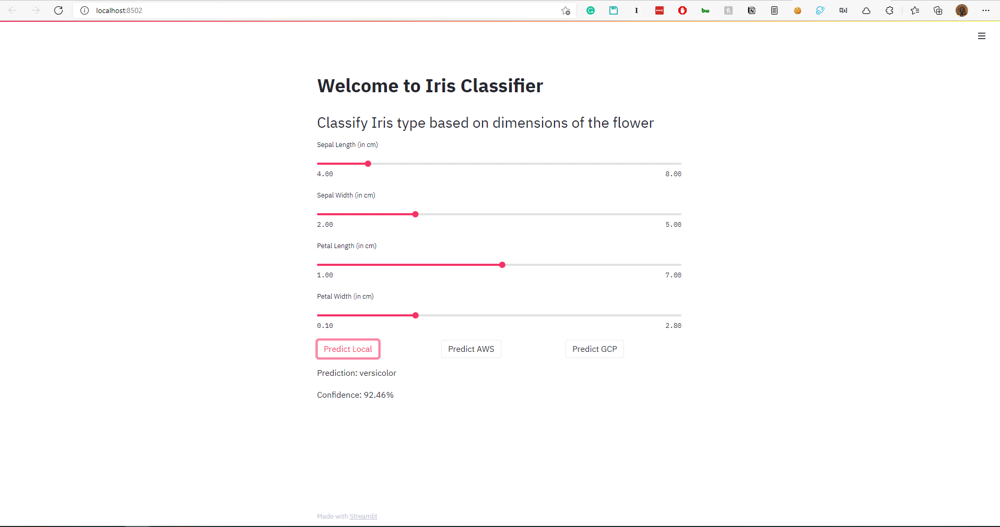

# Iris classification PoC deployed using AI Platform

## What this repo contains?

This repository has the code to train, save and test a simple ML model on the Iris Dataset. 
The Iris dataset is a small dataset which contains attributes of the flower - Sepal length, Sepal width, Petal length and Petal width.
The goal of the task is to classifiy based on these dimensions, the type of the Iris, which in the dataset is among three classes - Setosa, Versicolour and Virginica.

I also detail the steps required to deploy the model on the Google Cloud AI Platform.
And finally, the repository contains the code to run a Streamlit app with the model deployed on the AI Platform.

## Package Requirements
* A Google Cloud account and a Google Cloud Project (using GCP will cause money if you don't have any of the free $300 credits you get when you first sign up)
* Python 3.6+
* A simple 
`pip install -r requirements.txt` from the [iris_classification](iris_classification) directory will install the other Python packages reuqired.


## Steps to follow
In this PoC, I will be training and deploying a fairly simple ML model. If you follow this tutorial, deploying models should be fairly simple as well.

### 1. Training and Deploying the model locally

1. Clone this repo
```
git clone https://github.com/shreyansh26/Iris_classification-GCP-AI-Platform-PoC
```

2. Create a virtual environment - I use [Miniconda](https://docs.conda.io/en/latest/miniconda.html), but you can use any method (virtualenv, venv)
```
conda create -n iris_project python=3.8
conda activate iris_project
```

3. Install the required dependencies
```
pip install -r requirements.txt
```

4. Train the model
```
cd iris_classification/src
python train.py
```

3. Verify the model trained correctly using pytest
```
cd iris_classification
pytest
```

4. Activate Streamlit and run `app.py`
```
streamlit run app.py
```


Right now, the `Predict GCP` button will give an error on clicking. It requires a json configuration file which we will obtain when we deploy our model.
